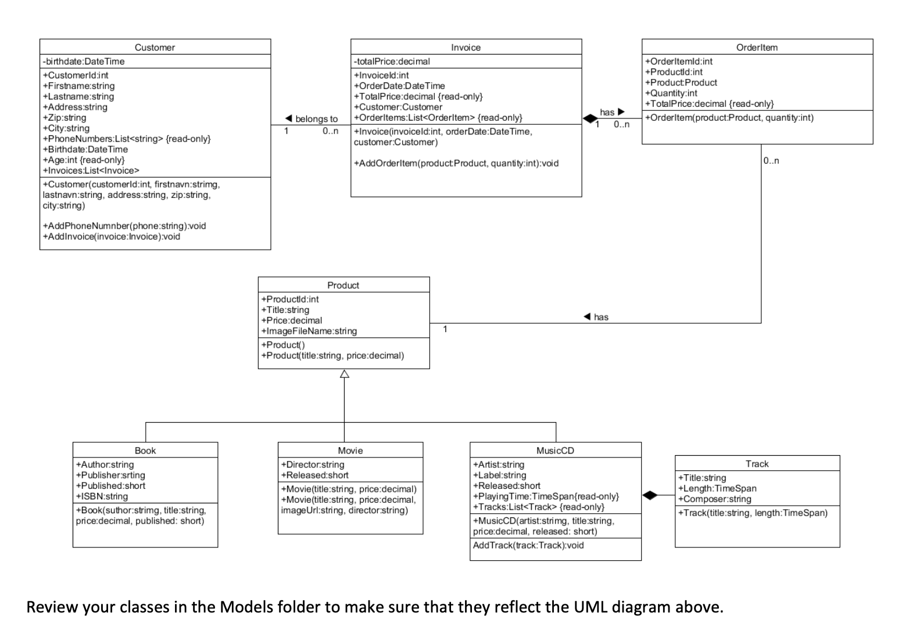
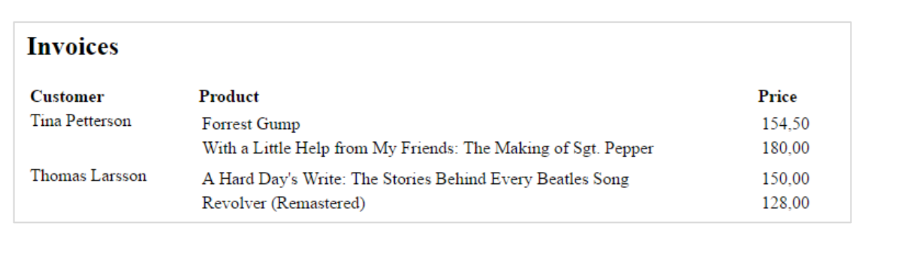
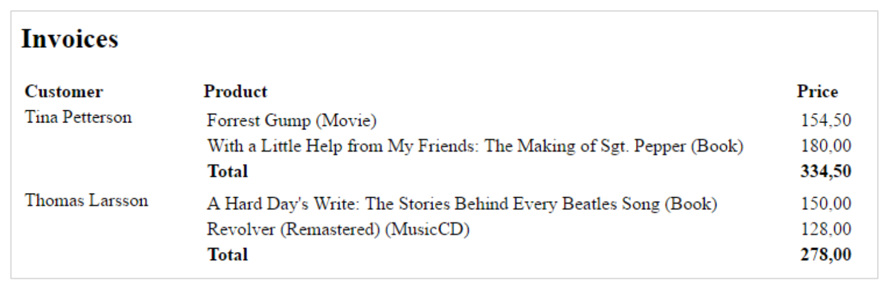
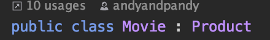

# mbm-store

A repo for a mandatory exercise in ASP.net

## Structure of readme

- General info
- Assignment description
- Solution explanation

## General info

This is not necessarily the correct solution, it's just a quick version of a solution.

Throughout this readme an explanation of what the exercise is about and how to solve it is described. Most likely a link to external resources is added for further reading.

## Assignment

This is the first of two mandatory assignments in backend programming that focus on the development of a website for MusicBookMovieStore.
The web site must present music-cd, book and movie catalogues for customers and enable online shopping.
In this assignment, you are supposed to build an early prototype with the basic domain classes. In the assignment, you must demonstrate that you are able to write and instantiate classes and display data objects inside an ASP.NET MVC web application.
At this stage of the development process, data are stored as non-persistent sample data inside the program itself, and there will be no administration part with HTML forms for data input and maintenance of music- cd, book and movie data.
The layout and design are not important in this assignment. In assignment two, we’ll focus more on design and add e-shop (“basket”) functionally.
The default view of the website – that loads when you run the project – must have links to the webpages that are part of the solution.
Hand-in and deployment
You can do the assignment individually or in small groups of max 2-3 persons. You must upload the assignment to Canvas as a .zip file containing the whole solution or to GitHub (or similar), that enables me to download and run your project locally.
The assignment must be approved in order to be recommended for examination in Backend Programming. Precondition
Before you start, be sure that you have completed exercise 1-4 in lesson 2, and exercise 1-5 in Lesson 3.

### Exercise 1
Add the Invoice and OrderItem classes to the Models folder and program them as specified by the UML diagram below:



### Exercise 2

In all previous exercises during this course, we have instantiated our model classes inside controllers. Normally you will do it elsewhere. A common way of doing it is to store the data in a database and writing a Data Access Layer (DAL) component that handles access to the database.

#### **The Repository Class**
For this exercise however, we will create a new Infrastructure folder with a static Repository class that we will use to hold example data to display inside the application. We’ll declare it as static because we have no requirement to store or retrieve data that is unique to an instance.

Create the static Repository class.

Declare a static Products property and instantiate it as a list of type Product, and likewise a static Invoices
property that is instantiated it as a list of type Invoice and:
```csharp
public static List<Product> Products = new List<Product>();
public static List<Invoice> Invoices = new List<Invoice>();
```
You should also create an empty constructor with no parameters.
Because the class is static, the constructor is not called through instantiation, and therefore the constructor in static classes does not have access modifiers (getters and setters). Consequently, it is declared as:
2
Backend programming, Mandatory Assignment 1

We now want to store our product objects as separate objects in the Products list. To do that, you must move all product objects instantiated in controllers into the Repository constructor, and you must add each product to the list of products, like this book object example:

```csharp
 Book b1 = new Book("Georg Martin", "With a Little Help from My Friends: The Movie Making of Sgt. Pepper", 1800M, 1995);
            b1.Publisher = "Little Brown & Co";
            b1.ISBN = "0316547832";
            b1.ImageFileName = "The Making of Sgt. Pepper.jpg";
```

#### **The Catalogue Controller**
When you have created all product objects inside the constructor of the repository class, you can fetch this list into the Catalogue controller by referencing the Products property of the Repository class inside the Index action method.
By saving the product list to a ViewBack property, you have access to the full products list in inside the view:
```csharp
ViewBag.Products = Repository.Products; 
```

#### **The View**
The next and final step is to display the full products list from inside the view grouped by categories.
You can now loop through the list and display products for each categories by selecting products by object type:

```csharp
<h2>The Movies</h2>
@foreach (Product product in @ViewBag.Products){

    if (product is Movie movie)
    {
        <div>
            <strong>Title: </strong> @movie.Title<br />
            Director: @movie.Director<br>
            Price: @($"{movie.Price:0.00}") <br /><br />
            
        </div>
    }
}

```

Tip
Alternatively, you also can send seperate Book, MusicCD and Movie lists to the view by using LINQ (Language-
foreach (Product product in ViewBag.Products)
 if (product is Movie)


Backend programming, Mandatory Assignment 1
Integrated Query) inside the controller to save each product type in its own category list, as in this example of the book list:
IEnumerable
As List<T> is in the namespace System.Collections.Generic and the method OfType<T>() is a LINQ method, you need to include these namespaces:
using System.Collections.Generic; using System.Linq;


### Exercise 3
Now, we want customers to buy our products.
You’ll do that by opening the Repository class and create a couple of Customer objects, and Invoice objects
with OrderItem and Customer object references. Add these objects to the Invoices list. To to that follow these steps:

1. Create (at least) two new Customer objects
2. Create (at least) two new Invoice objects
3. Create (at least) five new Product objects (or use the ones you already have)
4. Add two OrderItem objects to the first Invoice object
5. Add two OrderItem objects to the second Invoice object
6. Add each Invoice object to the Invoices list.

### Exercise 4
Create an Invoice controller class and return the list of Invoices to a ViewBag property to the view that is called from the Index action method. Use razor code inside the view to generate a display similar to this (or at least with the same information):



### Exercise 5
Enhance the involices list with catagories and total amounts:



## Solution

If it is unclear what MVC is then find content on google because there is a lot of it fx. [mvc explained](https://www.tomdalling.com/blog/software-design/model-view-controller-explained/)

In short:
> A model is just a class that has properties that match the data you are using in the application.

> A view is what is actually rendered. In other words its the html, css and js.

> A controller is the access to the web application. It is where the different HTTP methods are. When typing a url into a browser you are using a GET method. This just gets the webpage, but there are many others.

In this exercise there is only GET methods which means the controllers are rather limited as they do not do much besides get the data and give it to the view. The view then takes it and shows it to the user. Usually the data is stored in a database of some sort, but to avoid confusion for the students it's just a static class. 

If you are unaware of classes, objects, static etc. I would suggest reading up on what its all about because it is important to understand. [class and objects](https://www.tutorialspoint.com/java/java_object_classes.htm) (Yes I know its java but the same goes for c#)

[Alterative c# link](https://docs.microsoft.com/en-us/dotnet/csharp/programming-guide/classes-and-structs/objects)

In short:
> Object − Objects have states and behaviors. Example: A dog has states - color, name, breed as well as behaviors – wagging the tail, barking, eating. An object is an instance of a class.

> Class − A class can be defined as a template/blueprint that describes the behavior/state that the object of its type support.

### Exercise 1

Assuming previous assignments have created models for this given UML there should be a model for each type of data. 

The model classes represents domain-specific data and business logic in the MVC application. It represents the shape of the data as public properties and business logic as methods.

[Read more about models](https://www.tutorialsteacher.com/mvc/mvc-model)

So the exercise says create a bunch of classes that look like this UML diagram. If you don't know what UML diagrams are I would suggest looking through this [guide](https://www.visual-paradigm.com/guide/uml-unified-modeling-language/uml-class-diagram-tutorial/)


Basically Customers have Invoices, which are stored in the Invoices list. Invoices have OrderItems which are stored in OrderItems list. An OrderItem has a product and an amount which results in a totalprice. 

The Product is a super class as it has 3 children. You see this relationship based on the arrow pointing from Book, Movie, and MusicCD.


In short:
> A class inherits from another if it incorporates the bahvior of the other class. In other words, a Book is a Product, meaning a book will have all of the Products properties, methods etc.

This all leads to more complex programming with polymorphism and more. Generally, I would say compositional is better than inheritance. [Composition vs inheritance](https://en.wikipedia.org/wiki/Composition_over_inheritance)

Example of using inheritance:


Here Movie becomes a product. 

### Exercise 2

Instead of a database we have a static class which is fine for learning how everything works. 

[Read more about static classes](https://www.c-sharpcorner.com/UploadFile/74ce7b/static-class-in-C-Sharp/)

The catalogue controller basically just gives the view the Products list by using the ViewBag functionality of Razor pages. 

The View iterates through the products and renders them. Special annotation in html is always weird..

### Exercise 3 

Create a lot of objects inside the Repository and add them to the static lists. Be careful of null pointers, aka. objects that have properties which have not been initialised. 

### Exercise 4

Do the same again with invoices.

### Exercise 5 

Add an extra row with the total price. 